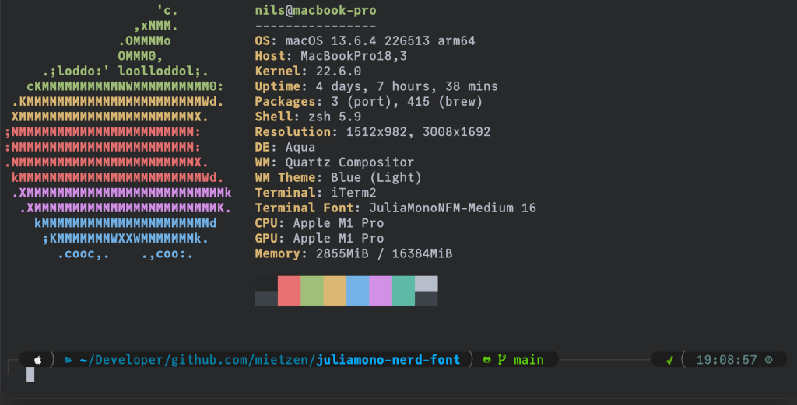

# JuliaMono extended Nerd-Fonts edition
  

This is the beautiful [JuliaMono](https://github.com/cormullion/juliamono) font by cormullion, extended via fontforge (aka [Nerd Fonts Patcher](https://github.com/ryanoasis/nerd-fonts#font-patcher)) with variable width glyphs and propo variants from the Nerd Fonts project.

Forked from [mietzen's single width glyphs patch](https://github.com/mietzen/juliamono-nerd-font). The `--mono` version causes funky looking glyphs in my waybar config similar to [this](https://old.reddit.com/r/voidlinux/comments/10o6yql/nerdfont_glyphs_too_small_on_waybar).

**Feel free to fork and modify!**

### [Download](https://github.com/mietzen/juliamono-nerd-font/releases/download/v0.056/fonts.zip)

## Example

>Theme:&nbsp;&nbsp;&nbsp;[romkatv/powerlevel10k](https://github.com/romkatv/powerlevel10k)\
>Color:&nbsp;&nbsp;&nbsp;&nbsp;&nbsp;&nbsp;base16_edge-dark by: [chriskempson/base16-shell](https://github.com/chriskempson/base16-shell)

